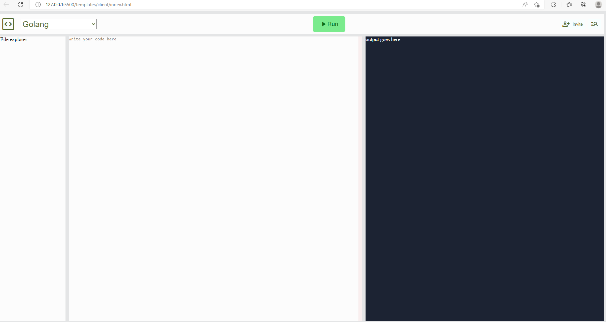
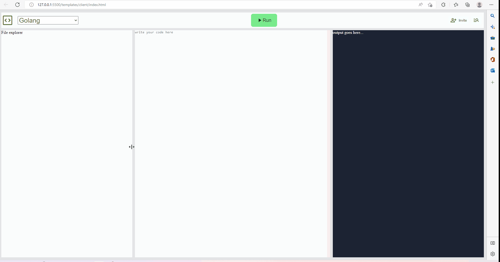

# cloudcode

Very first day look and feel

### Animated look and feel (quickly see what inside)

## go-chi router installation
> `go get -u github.com/go-chi/chi/v5`

## Learning Resource
* [Make a resizable element](https://htmldom.dev/make-a-resizable-element)
* [Hex to RGB](https://www.webfx.com/web-design/hex-to-rgb)
* [JS Color picker](https://jscolor.com)
* [CSS_Flexible_Box_Layout](https://developer.mozilla.org/en-US/docs/Web/CSS/CSS_Flexible_Box_Layout/Aligning_Items_in_a_Flex_Container)
* [Custom scrolling style](https://codepen.io/devstreak/pen/dMYgeO)
* [CSS Gradient generator](https://cssgradient.io)
* [go-i18n](https://lokalise.com/blog/go-internationalization-using-go-i18n)
* [go template Internationalisation](https://phrase.com/blog/posts/internationalisation-in-go-with-go-i18n)
* [code example](https://github.com/nicksnyder/go-i18n/blob/main/v2/example/main.go)
* [TOML PACKAGE](https://github.com/BurntSushi/toml)